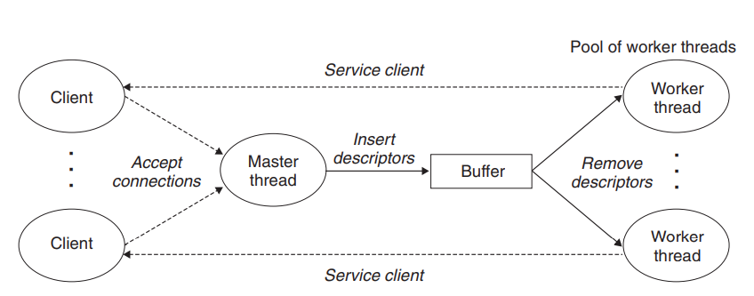

# Concurrent Caching Web Proxy

  - [Introduction](#introduction)
  - [Requirements](#requirements)
  - [Design](#design)
    - [1. Part I: Sequential web proxy](#1-part-i-sequential-web-proxy)
    - [2. Part II: Concurrent web proxy](#2-part-ii-concurrent-web-proxy)
    - [3. Part III: Concurrent web proxy with cache](#3-part-iii-concurrent-web-proxy-with-cache)
  - [Usage](#usage)

## Introduction

This Web proxy will act as a middleman between a Web browser and an end server. Instead of contacting the end server directly, the browser contacts the proxy, which forwards the request to the end server. When the end server replies to the proxy, the proxy sends the reply to the browser.

## Requirements

1. The Web proxy should handle HTTP/1.0 GET requests from clients.
2. The proxy must handle multiple requests at the same time without race conditions, deadlock, or other synchronization errors.
3. The Web proxy should store recently-used Web objects in memory. Specifically, when the proxy receives a web object from a server, it will cache it in memory as it transmits the object to the client.

## Design

### 1. Part I: Sequential web proxy

In this part, I implemented a basic sequential proxy that handles HTTP/1.0 GET requests. The proxy is sequential since it can only handle one request at a time. Incoming connection requests must wait until the current request is finished.

When started, the proxy listens for incoming connections on a port that is specified on the command line. Once a connection is established, the proxy will read the request from the client and parse the request. If the HTTP request is valid, it will then establish its own connection to the approriate web server to request the web object specified by the client. Finally, the proxy reads the server's response and forwards it to the client.

For example, when an end user enters a URL such as ```http://www.google.com/index.html``` into the address bar of a web browser, the browser will send an HTTP request to the proxy:

```GET http://www.google.com/index.html HTTP/1.1```

The proxy will parse the request and send to the server in the following form:

```GET /index.html HTTP/1.0```

### 2. Part II: Concurrent web proxy

There are two possible ways to design a current web proxy:
1. Spawning a new thread to handle each new connection request. Each new thread should run in the detached mode so that the kernel can free it after it terminates.
2. Using a prethreaded server consisting of the main thread and a set of worker threads. The main thread repeatedly accepts connection requests from clients and places the resulting connected descriptors in a bounded buffer. Each worker thread repeatedly removes a descriptor from the buffer, services the client, and then waits for the next descriptor. (Figure from CS:APP textbook).



The disadvantage of the first approach is that we incur the cost of creating a new thread for each new client (change registers, stack pointers, program counters, etc). The advantage of a prethreaded server is that we can reduce the overhead of creating new threads. However, I chose to use the first approach since we don't know how many work threads can handle multiple clients efficiently.

If we create too many worker threads, some of them will never be used, thus wasting operating system's resources. If there are just a few worker threads, the server will be slow since worker threads are busy servicing some clients, making other clients wait.

### 3. Part III: Concurrent web proxy with cache

In this part, we will add an LRU cache to our proxy so that it can give clients their recently used contents faster instead of fetching web objects from the server. The cache will have a maximum size of 1 MB and allow web objects with a maximum size of 100 KB.

General working of the cache: For each active connection, we create a buffer to accumulate data the proxy receives from the server. If the size of the buffer exceeds the maximum object size, it will be discarded. Otherwise, the object can be cached.

In addition, accesses to cache must be thread-safe. To solve this problem, I implemented a readers-writers lock that favors readers. Specifically, multiple threads are able to read from the cache simultaneously. However, only one thread can write to the cache at a time. If there is any thread reading the cache, the thread that wants to update the cache must wait until no thread reads the cache.

## Usage

The web proxy must be run on operating systems of Unix family.

1. Clone this repo.
2. ```cd``` into the repo, and then use the command ```make```.
3. Run the proxy on a valid port (from 1024 to 65536): ```./proxy <port>```.
4. Use ```telnet``` to open a connection to the proxy and send it HTTP requests.

Example:
- First, open a terminal window, then run ```./proxy <port>```.
- Then, open another terminal, then run ```telnet localhost <port>``` (we are running the proxy on our machine - localhost).
- Send the proxy an HTTP request: ```GET http://www.google.com HTTP/1.0```.
- Type in any additional HTTP headers in form: ```<field>: <value>```.
- Type in one blank to end the HTTP request.

In addition, we can also use our proxy in the most recent version of Mozilla Firefox to replace the proxy of Firefox.